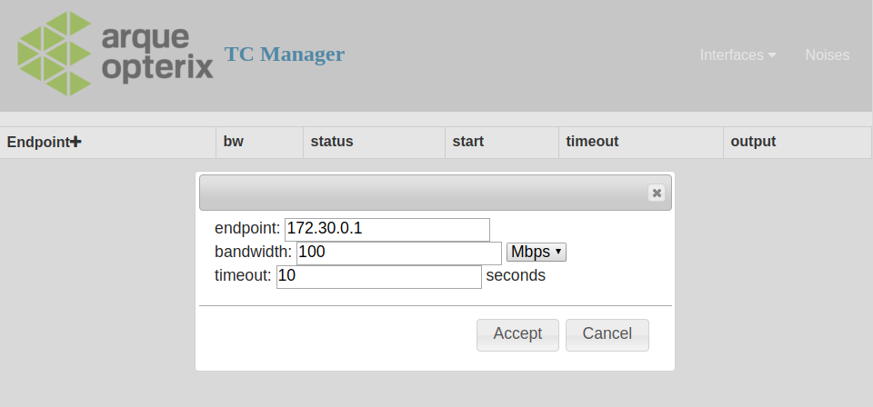
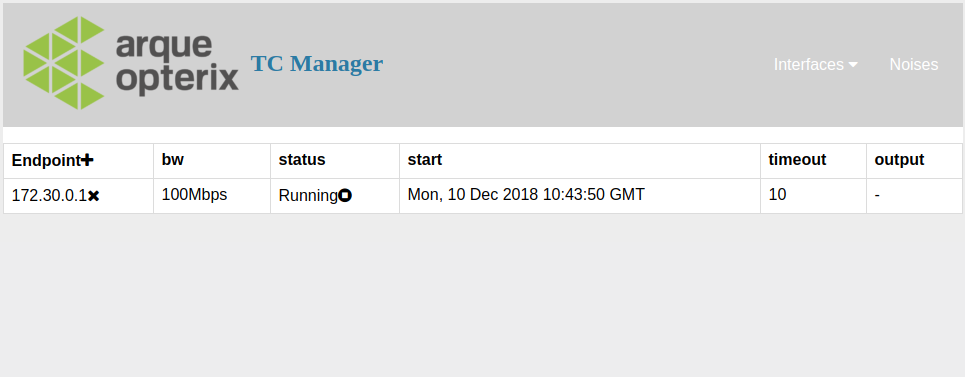
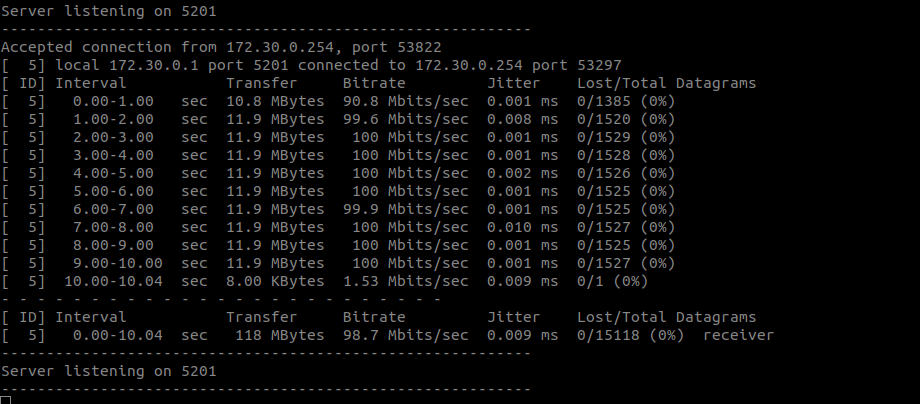
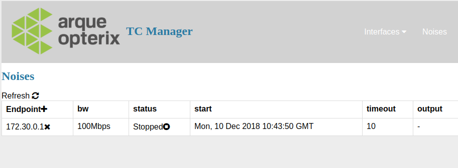

# Noise Generator
 
 
## ¿What is for?
Noise Generator offers a REST API to set an UDP stream towards an iperf3 server endpoint.

It belongs to the Arqueopterix Project and It is used to set traffic noise on a network interface.
In the project the Noise generator set an udp stream towards an iperf3 server endpoint to add non-prioritized traffic 
to a router output interface.
The default throughput of the UDP flow is 100Mbps and It will run for 60 seconds, but you can add a
 specific throughput and timeout for the UDP flow.   

More information of the Arqueopterix project at: [Confluence](https://intranet.gradiant.org/confluence/display/IAP).
 
## License
LICENSE file
 
  
## Dependencies
List of dependencies
- External dependencies
    * **python3**
    * **Flask** 1.0.2
    * **iperf** 3.5
    
Python Dependencies can be install with
 
```python3 -m pip install -r requirements.txt```

Sources for iperf 3.5 can be found here: https://github.com/esnet/iperf/archive/3.5.tar.gz.
  
## Getting Started

### Docker Readme
Build the docker image with

```
docker build -t noise-generator .

```

Run the docker image using the host network stack:

```
docker run --rm -ti --net=host noise-generator

```

Open the [http://localhost:5001](noise-generator-ui)


### Quick Test
To test Noise Generator run ```./run.sh```.

It deploys an iperf3 server at container *c1* connected to a docker network *tcnet*.
Then it launches the noise-gen to manage udp noise flows. We will test the generation of udp noise flows towards c1.

```
  ___________     ________________   
|iperf3-server|   |   noise-gen    |  
| __________  |   |  __________    |
|| eth0     | |   | |  eth0    |   |
||172.30.0.1| |   |_|_172.30.0.2___| 
      |________________|           
            noisenet

``` 
Open a terminal and get h1 output logs: 

`docker logs -f iperf3-server`


Open [noise-geneartor-ui](http://localhost:5001).

To add noise traffic at noisenet, click on the (+) button at the endpoint table header.
Configure a UDP flow to h1 (172.30.0.1). You can also set the UDP port with IP:port. If not set, the default value is 5201.



The noise should be added to the noise table:



and the noise should arrive to iperf3-server (see iperf3-server log with `docker logs iperf3-server`):



Noise flows are not automatically refreshed, you have to refresh the table to get any status update.

For example, flow should be stopped if you refresh the table after 10 seconds (default timeout):




You can manually stop the flow if you press in the stop icon next to the flow status.
You can remote the flow from the table pressing the (X) next to the endpoint. Note: flow is stopped before being removed.
Received rate should mirror the policy rate.
